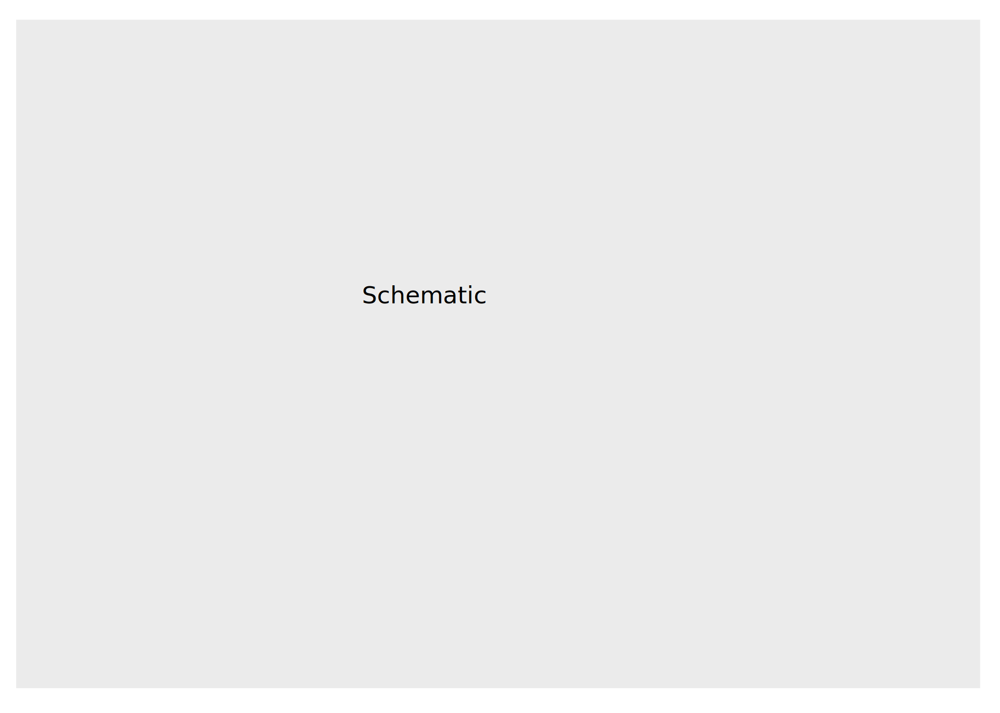

## Results

### MAEs mechanistically account for patient-to-patient variation

{#fig:cartoon width="100%"}

- Schematic of autoencoder structure
- Cartoon description of other encoder structures
- Part of this would be to speak to the generality of the approach

### Figure 2

Initial plot of proteomic data (clustergram?) - see #23
Data-driven selection of network nodes from OHSU

### Figure 4

Training against actual data
Description of fit model

### Figure 5

Cell line perturbation
Description of that data

### Figure 6

Model/validation comparison
